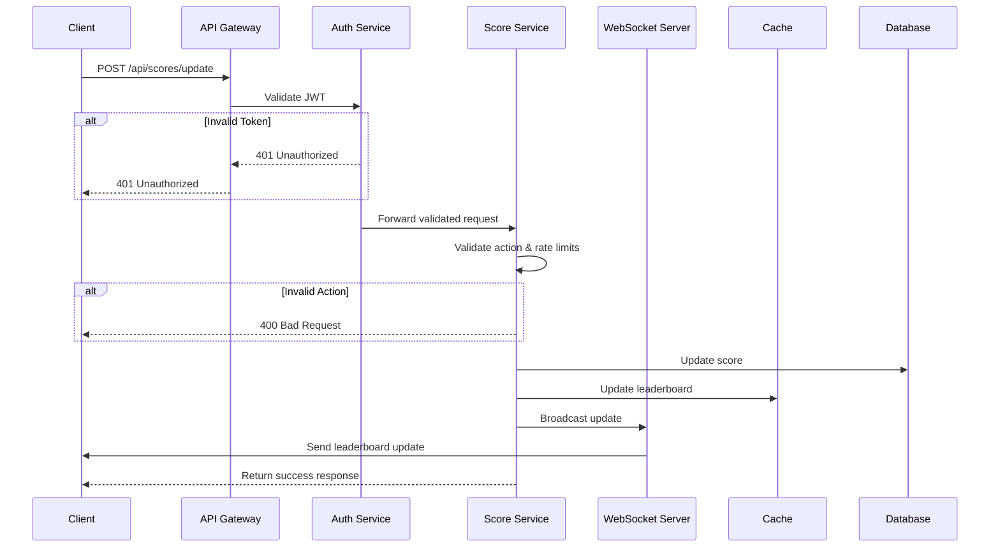
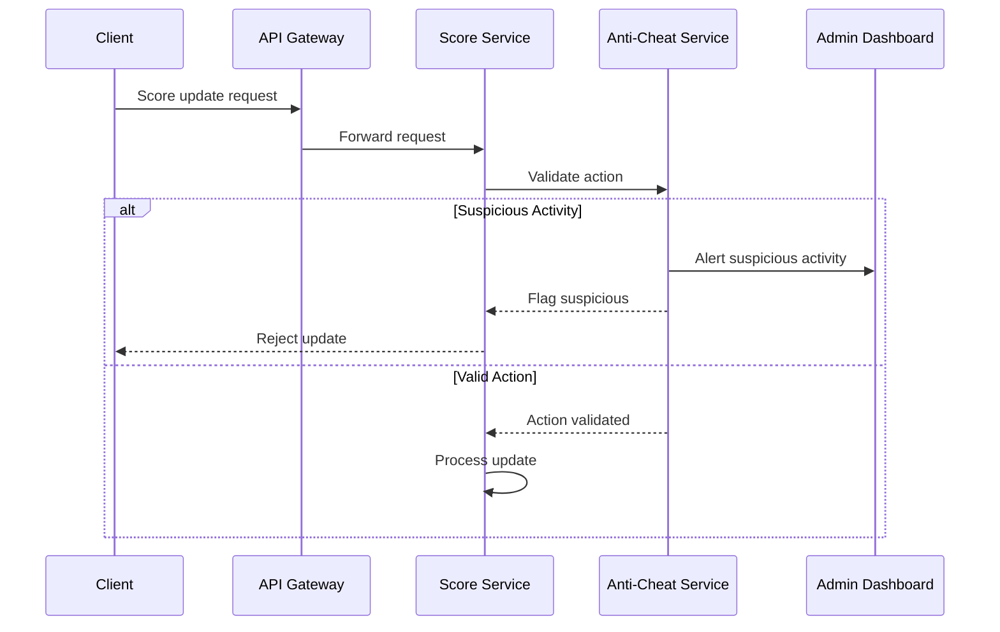

# Score Update Flow Diagram

```mermaid
sequenceDiagram
    participant Client
    participant API Gateway
    participant Auth Service
    participant Score Service
    participant WebSocket Server
    participant Cache
    participant Database

    Client->>API Gateway: POST /api/scores/update
    API Gateway->>Auth Service: Validate JWT
    
    alt Invalid Token
        Auth Service-->>API Gateway: 401 Unauthorized
        API Gateway-->>Client: 401 Unauthorized
    end
    
    Auth Service->>Score Service: Forward validated request
    Score Service->>Score Service: Validate action & rate limits
    
    alt Invalid Action
        Score Service-->>Client: 400 Bad Request
    end
    
    Score Service->>Database: Update score
    Score Service->>Cache: Update leaderboard
    Score Service->>WebSocket Server: Broadcast update
    WebSocket Server->>Client: Send leaderboard update
    Score Service-->>Client: Return success response
```
# Anti-Cheat Detection Flow

```mermaid
sequenceDiagram
    participant Client
    participant API Gateway
    participant Score Service
    participant Anti-Cheat Service
    participant Admin Dashboard
    
    Client->>API Gateway: Score update request
    API Gateway->>Score Service: Forward request
    Score Service->>Anti-Cheat Service: Validate action
    
    alt Suspicious Activity
        Anti-Cheat Service->>Admin Dashboard: Alert suspicious activity
        Anti-Cheat Service-->>Score Service: Flag suspicious
        Score Service-->>Client: Reject update
    else Valid Action
        Anti-Cheat Service-->>Score Service: Action validated
        Score Service->>Score Service: Process update
    end
``` 